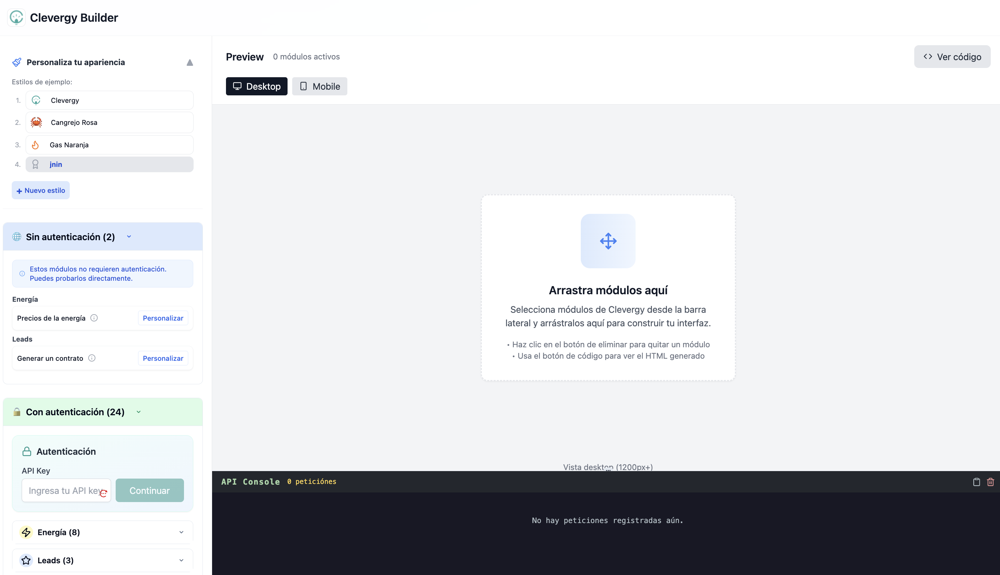

# Clevergy Microfrontend Builder Demo

Este proyecto demuestra lo sencillo que es implementar y utilizar los microfrontends de Clevergy en tu aplicación. Es un ejemplo práctico que muestra cómo integrar componentes de Clevergy de manera rápida y eficiente.

## 🚀 Demo en vivo

Puedes ver una demostración en vivo de este proyecto aquí:
[Demo Clevergy Builder](https://alejandroramirezj.github.io/clevergyBuilder/)



---

## ✨ ¿Qué puedes hacer con el Builder de Clevergy?

Con el Builder puedes crear y personalizar módulos de energía de forma visual, sencilla y divertida. Aquí tienes todo lo que puedes hacer:

1. 👀 **Visualizar los módulos públicos**
   - Explora todos los módulos que no requieren autenticación, listos para usar.

2. 🛠️ **Personalizar los módulos**
   - Cambia atributos y opciones, por ejemplo: mostrar la línea de precios excedentes, ocultar detalles, etc.

3. 🎨 **Personalizar colores y estilos**
   - Adapta los módulos a tu marca cambiando colores, fuentes y estilos para que encajen perfectamente en tu web.

4. 🔒 **Visualizar módulos privados**
   - Descubre los módulos que requieren autenticación del usuario para ser personalizados e integrados.

5. 🖥️ **Ver las peticiones al API de Connect**
   - Observa en la consola todas las peticiones que se hacen al API de Connect para entender cómo funciona la integración.

6. 🧩 **Ver el código HTML generado**
   - Obtén el código HTML listo para copiar y pegar en tu proyecto, ¡así de fácil!


---

## 📚 Documentación

Para más información sobre Clevergy y sus servicios, visita:

- [Documentación de Clevergy](https://docs.clever.gy)
- [Portal de Conexión de Clevergy](https://connect.clever.gy)

## 🛠️ Tecnologías Utilizadas

Este proyecto está construido con:

- Vite
- TypeScript
- React
- shadcn-ui
- Tailwind CSS

## 🚀 Cómo Empezar

1. Clona este repositorio:
```sh
git clone https://github.com/alejandroramirezj/clevergy-drag-drop-builder.git
```

2. Instala las dependencias:
```sh
npm install
```

3. Inicia el servidor de desarrollo:
```sh
npm run dev
```

## 🎯 Características

- Implementación de microfrontends de Clevergy
- Interfaz de usuario moderna y responsiva
- Componentes reutilizables
- Fácil integración con aplicaciones existentes

## 🤝 Contribuir

Las contribuciones son bienvenidas. Por favor, abre un issue primero para discutir los cambios que te gustaría hacer.

## 📝 Licencia

Este proyecto está bajo la Licencia MIT. Ver el archivo `LICENSE` para más detalles.
